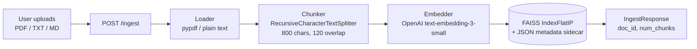
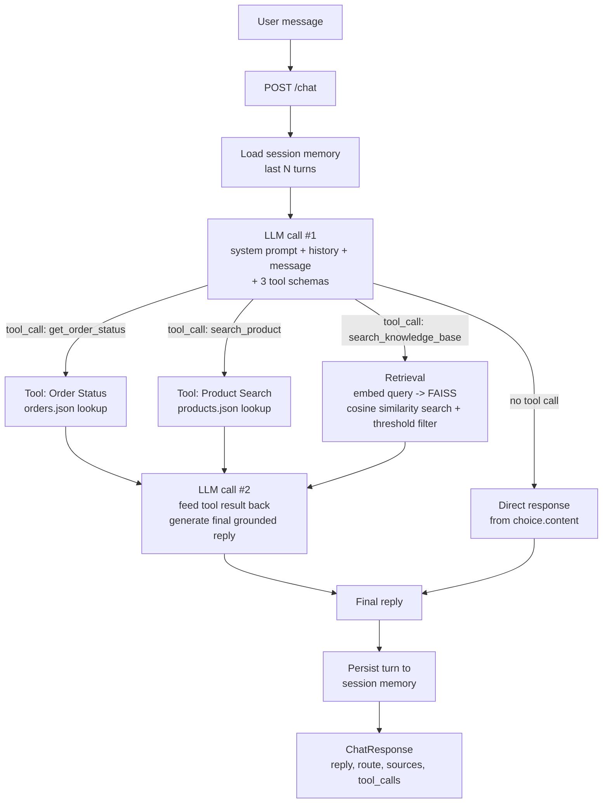

# Architecture / Pipeline Diagram

## 1. Ingestion pipeline

## 2. Chat pipeline (single-agent-with-tools)

## 3. Routing decision

The routing decision is made **inside a single OpenAI chat completion call**
using native function calling (`tool_choice="auto"`), rather than a separate
hand-written classifier step:

| User intent | Tool the LLM calls | Executed by |
|---|---|---|
| "Where is my order ORD001?" | `get_order_status` | `app/tools/order_status.py` |
| "Do you have a wireless mouse?" | `search_product` | `app/tools/product_search.py` |
| "What does the uploaded doc say about X?" | `search_knowledge_base` | `app/retrieval/retriever.py` |
| "Hi", "thanks", "what's my name?" (already in history) | *(none)* | Direct LLM response using conversation memory |

If `search_knowledge_base` finds no chunk above the similarity threshold, the
tool result tells the LLM there is no relevant context, and the system prompt
instructs it to reply with the exact required fallback string.
